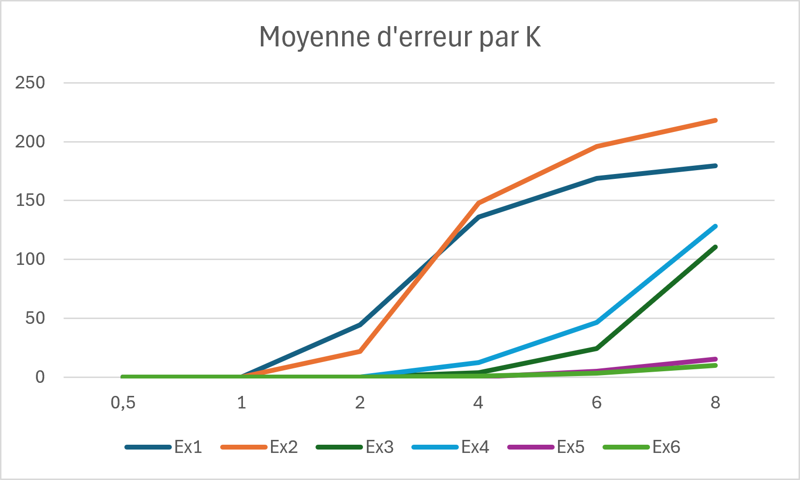

# Labo 3 GRE - Algo A*
Par Théo et Mauro Santos
# Resultats obtenus

## Experiment 1 - Relief très peu dense, labyrinthe très ouvert

### Heuristic 0 - DIJKSTRA:
Average length: 480.4000000000003

Average processed vertices: 63295.09000000001

Improvement percentage (compared to H0): 0.0

Average expansion rate: 0.007621558927009536

### Heuristic 1 - INFINITY_NORM:
Average length: 480.4000000000003

Average processed vertices: 16941.309999999998

Improvement percentage (compared to H0): 73.24610244457304

Average expansion rate: 0.02866258238675077

### Heuristic 2 - EUCLIDEAN_NORM:
Average length: 480.4000000000003

Average processed vertices: 14646.250000000002

Improvement percentage (compared to H0): 76.85843661297444

Average expansion rate: 0.03326387558294026

### Heuristic 3 - MANHATTAN:
Average length: 480.4000000000003

Average processed vertices: 16568.89

Improvement percentage (compared to H0): 73.83078060379958

Average expansion rate: 0.029350502751557726

### Heuristic 4 - K_MANHATTAN (k=0.5):
Average length: 480.4000000000003

Average processed vertices: 31894.07000000001

Minimal Error:0.0

Average Error:0.0

Maximal Error:0.0

Average processed vertices reduction (compared to H3): -15325.180000000011

Average processed vertices reduction % (compared to H3): -92.49370356131287

### Heuristic 5 - K_MANHATTAN (k=2):
Average length: 524.8799999999999

Average processed vertices: 3180.7900000000004

Minimal Error:0.0

Average Error:44.48

Maximal Error:140.0

Average processed vertices reduction (compared to H3): 13388.099999999999

Average processed vertices reduction % (compared to H3): 80.80263674875022

### Heuristic 6 - K_MANHATTAN (k=4):
Average length: 616.5600000000001

Average processed vertices: 895.46

Minimal Error:28.0

Average Error:136.16

Maximal Error:268.0

Average processed vertices reduction (compared to H3): 15673.43

Average processed vertices reduction % (compared to H3): 94.5955341607072

### Heuristic 7 - K_MANHATTAN (k=6):
Average length: 649.16

Average processed vertices: 685.05

Minimal Error:56.0

Average Error:168.76

Maximal Error:320.0

Average processed vertices reduction (compared to H3): 15883.84

Average processed vertices reduction % (compared to H3): 95.86544421503191

### Heuristic 8 - K_MANHATTAN (k=8):
Average length: 659.8399999999998

Average processed vertices: 636.2100000000003

Minimal Error:76.0

Average Error:179.44

Maximal Error:360.0

Average processed vertices reduction (compared to H3): 15932.679999999998

Average processed vertices reduction % (compared to H3): 96.16021350856937

### Summary Tables

#### Admissible Heuristics (H0 - H3)

| Heuristic | Average length | Average processed vertices | Improvement percentage | Average expansion rate |
|---|---|---|---------------------|---|
| 0 - DIJKSTRA | 480.4000000000003 | 63295.09000000001 | 0.0                 | 0.007621558927009536 |
| 1 - INFINITY_NORM | 480.4000000000003 | 16941.309999999998 | 73.24610244457304                    | 0.02866258238675077 |
| 2 - EUCLIDEAN_NORM | 480.4000000000003 | 14646.250000000002 | 76.85843661297444                 | 0.03326387558294026 |
| 3 - MANHATTAN | 480.4000000000003 | 16568.89 | 73.83078060379958                | 0.029350502751557726 |

#### k_Mahattans (H4 - H8)

| Heuristic | Average length | Avg processed vertices | Min Error | Avg Error | Max Error | Vertices reduction | Reduction % |
|---|---|---|---|---|---|---|---|
| 4 - K_MANHATTAN (k=0.5) | 480.4000000000003 | 31894.07000000001 | 0.0 | 0.0 | 0.0 | -15325.180000000011 | -92.49370356131287 |
| 5 - K_MANHATTAN (k=2) | 524.8799999999999 | 3180.7900000000004 | 0.0 | 44.48 | 140.0 | 13388.099999999999 | 80.80263674875022 |
| 6 - K_MANHATTAN (k=4) | 616.5600000000001 | 895.46 | 28.0 | 136.16 | 268.0 | 15673.43 | 94.5955341607072 |
| 7 - K_MANHATTAN (k=6) | 649.16 | 685.05 | 56.0 | 168.76 | 320.0 | 15883.84 | 95.86544421503191 |
| 8 - K_MANHATTAN (k=8) | 659.8399999999998 | 636.2100000000003 | 76.0 | 179.44 | 360.0 | 15932.679999999998 | 96.16021350856937 |

## Experiment 2 - Relief très peu dense, labyrinthe assez ouvert

### Heuristic 0 - DIJKSTRA:
Average length: 549.2

Average processed vertices: 61928.78

Improvement percentage (compared to H0): 0.0

Average expansion rate: 0.008927529046760174

### Heuristic 1 - INFINITY_NORM:
Average length: 549.2

Average processed vertices: 19259.630000000005

Improvement percentage (compared to H0): 68.57226837228721

Average expansion rate: 0.028914334539540988

### Heuristic 2 - EUCLIDEAN_NORM:
Average length: 549.2

Average processed vertices: 17054.74

Improvement percentage (compared to H0): 72.10613450651249

Average expansion rate: 0.03274800435545333

### Heuristic 3 - MANHATTAN:
Average length: 549.2

Average processed vertices: 18867.17999999999

Improvement percentage (compared to H0): 69.14140769306513

Average expansion rate: 0.029607485442292143

### Heuristic 4 - K_MANHATTAN (k=0.5):
Average length: 549.2

Average processed vertices: 33554.899999999994

Minimal Error:0.0

Average Error:0.0

Maximal Error:0.0

Average processed vertices reduction (compared to H3): -14687.720000000005

Average processed vertices reduction % (compared to H3): -77.84798788160188

### Heuristic 5 - K_MANHATTAN (k=2):
Average length: 571.2799999999997

Average processed vertices: 4986.510000000001

Minimal Error:0.0

Average Error:22.08

Maximal Error:84.0

Average processed vertices reduction (compared to H3): 13880.669999999987

Average processed vertices reduction % (compared to H3): 73.57045409011837

### Heuristic 6 - K_MANHATTAN (k=4):
Average length: 697.2399999999999

Average processed vertices: 1363.79

Minimal Error:36.0

Average Error:148.04

Maximal Error:252.0

Average processed vertices reduction (compared to H3): 17503.38999999999

Average processed vertices reduction % (compared to H3): 92.77162776843173

### Heuristic 7 - K_MANHATTAN (k=6):
Average length: 744.9599999999998

Average processed vertices: 1009.7200000000003

Minimal Error:36.0

Average Error:195.76

Maximal Error:376.0

Average processed vertices reduction (compared to H3): 17857.45999999999

Average processed vertices reduction % (compared to H3): 94.6482728208455

### Heuristic 8 - K_MANHATTAN (k=8):
Average length: 767.1999999999999

Average processed vertices: 932.2699999999999

Minimal Error:48.0

Average Error:218.0

Maximal Error:424.0

Average processed vertices reduction (compared to H3): 17934.90999999999

Average processed vertices reduction % (compared to H3): 95.0587740192228

### Summary Tables

#### Admissible Heuristics (H0 - H3)

| Heuristic | Average length | Average processed vertices | Improvement percentage | Average expansion rate |
|---|---|---|------------------------|---|
| 0 - DIJKSTRA | 549.2 | 61928.78 | 0.0                    | 0.008927529046760174 |
| 1 - INFINITY_NORM | 549.2 | 19259.630000000005 | 68.57226837228721      | 0.028914334539540988 |
| 2 - EUCLIDEAN_NORM | 549.2 | 17054.74 | 72.10613450651249      | 0.03274800435545333 |
| 3 - MANHATTAN | 549.2 | 18867.17999999999 | 69.14140769306513      | 0.029607485442292143 |

#### k_Manhattans (H4 - H8)

| Heuristic | Average length | Avg processed vertices | Min Error | Avg Error | Max Error | Vertices reduction | Reduction % |
|---|---|---|---|---|---|---|---|
| 4 - K_MANHATTAN (k=0.5) | 549.2 | 33554.899999999994 | 0.0 | 0.0 | 0.0 | -14687.720000000005 | -77.84798788160188 |
| 5 - K_MANHATTAN (k=2) | 571.2799999999997 | 4986.510000000001 | 0.0 | 22.08 | 84.0 | 13880.669999999987 | 73.57045409011837 |
| 6 - K_MANHATTAN (k=4) | 697.2399999999999 | 1363.79 | 36.0 | 148.04 | 252.0 | 17503.38999999999 | 92.77162776843173 |
| 7 - K_MANHATTAN (k=6) | 744.9599999999998 | 1009.7200000000003 | 36.0 | 195.76 | 376.0 | 17857.45999999999 | 94.6482728208455 |
| 8 - K_MANHATTAN (k=8) | 767.1999999999999 | 932.2699999999999 | 48.0 | 218.0 | 424.0 | 17934.90999999999 | 95.0587740192228 |

## Experiment 3 - Relief très peu dense, labyrinthe peu ouvert

### Heuristic 0 - DIJKSTRA:
Average length: 2078.22

Average processed vertices: 82482.26

Improvement percentage (compared to H0): 0.0

Average expansion rate: 0.03042234639016741

### Heuristic 1 - INFINITY_NORM:
Average length: 2078.22

Average processed vertices: 56310.270000000004

Improvement percentage (compared to H0): 32.834259944012715

Average expansion rate: 0.045476649501540255

### Heuristic 2 - EUCLIDEAN_NORM:
Average length: 2078.22

Average processed vertices: 54204.98000000002

Improvement percentage (compared to H0): 35.55286128394163

Average expansion rate: 0.04737294779119359

### Heuristic 3 - MANHATTAN:
Average length: 2078.22

Average processed vertices: 55343.45999999999

Improvement percentage (compared to H0): 33.999685713011814

Average expansion rate: 0.046528337913008894

### Heuristic 4 - K_MANHATTAN (k=0.5):
Average length: 2078.22

Average processed vertices: 67158.87000000001

Minimal Error:0.0

Average Error:0.0

Maximal Error:0.0

Average processed vertices reduction (compared to H3): -11815.410000000018

Average processed vertices reduction % (compared to H3): -21.34924343364152

### Heuristic 5 - K_MANHATTAN (k=2):
Average length: 2078.2999999999997

Average processed vertices: 39065.71

Minimal Error:0.0

Average Error:0.08

Maximal Error:4.0

Average processed vertices reduction (compared to H3): 16277.749999999993

Average processed vertices reduction % (compared to H3): 29.41223768806648

### Heuristic 6 - K_MANHATTAN (k=4):
Average length: 2082.1

Average processed vertices: 22317.46000000001

Minimal Error:0.0

Average Error:3.88

Maximal Error:164.0

Average processed vertices reduction (compared to H3): 33025.999999999985

Average processed vertices reduction % (compared to H3): 59.674620994061435

### Heuristic 7 - K_MANHATTAN (k=6):
Average length: 2102.5000000000005

Average processed vertices: 16277.810000000005

Minimal Error:0.0

Average Error:24.28

Maximal Error:292.0

Average processed vertices reduction (compared to H3): 39065.64999999999

Average processed vertices reduction % (compared to H3): 70.58765389803962

### Heuristic 8 - K_MANHATTAN (k=8):
Average length: 2188.9400000000005

Average processed vertices: 14202.16

Minimal Error:0.0

Average Error:110.72

Maximal Error:1136.0

Average processed vertices reduction (compared to H3): 41141.29999999999

Average processed vertices reduction % (compared to H3): 74.33814221228668

### Summary Tables

#### Admissible Heuristics (H0 - H3)

| Heuristic | Average length | Average processed vertices | Improvement percentage | Average expansion rate |
|---|---|---|------------------------|---|
| 0 - DIJKSTRA | 2078.22 | 82482.26 | 0.0                    | 0.03042234639016741 |
| 1 - INFINITY_NORM | 2078.22 | 56310.270000000004 | 32.834259944012715                   | 0.045476649501540255 |
| 2 - EUCLIDEAN_NORM | 2078.22 | 54204.98000000002 | 35.55286128394163                    | 0.04737294779119359 |
| 3 - MANHATTAN | 2078.22 | 55343.45999999999 | 33.999685713011814                   | 0.046528337913008894 |

#### k_Mahattans (H4 - H8)

| Heuristic | Average length | Avg processed vertices | Min Error | Avg Error | Max Error | Vertices reduction | Reduction % |
|---|---|---|---|---|---|---|---|
| 4 - K_MANHATTAN (k=0.5) | 2078.22 | 67158.87000000001 | 0.0 | 0.0 | 0.0 | -11815.410000000018 | -21.34924343364152 |
| 5 - K_MANHATTAN (k=2) | 2078.2999999999997 | 39065.71 | 0.0 | 0.08 | 4.0 | 16277.749999999993 | 29.41223768806648 |
| 6 - K_MANHATTAN (k=4) | 2082.1 | 22317.46000000001 | 0.0 | 3.88 | 164.0 | 33025.999999999985 | 59.674620994061435 |
| 7 - K_MANHATTAN (k=6) | 2102.5000000000005 | 16277.810000000005 | 0.0 | 24.28 | 292.0 | 39065.64999999999 | 70.58765389803962 |
| 8 - K_MANHATTAN (k=8) | 2188.9400000000005 | 14202.16 | 0.0 | 110.72 | 1136.0 | 41141.29999999999 | 74.33814221228668 |

## Experiment 4 - Relief dense, labyrinthe moyennement ouvert

### Heuristic 0 - DIJKSTRA:
Average length: 2432.1099999999997

Average processed vertices: 82707.64

Improvement percentage (compared to H0): 0.0

Average expansion rate: 0.03697478651840247

### Heuristic 1 - INFINITY_NORM:
Average length: 2432.1099999999997

Average processed vertices: 57876.83

Improvement percentage (compared to H0): 30.31759726829282

Average expansion rate: 0.0531214201533274

### Heuristic 2 - EUCLIDEAN_NORM:
Average length: 2432.1099999999997

Average processed vertices: 55763.49

Improvement percentage (compared to H0): 32.81298590667417

Average expansion rate: 0.055276214194735745

### Heuristic 3 - MANHATTAN:
Average length: 2432.1099999999997

Average processed vertices: 56755.54

Improvement percentage (compared to H0): 31.278389595464283

Average expansion rate: 0.054348829401251665

### Heuristic 4 - K_MANHATTAN (k=0.5):
Average length: 2432.1099999999997

Average processed vertices: 67949.11999999998

Minimal Error:0.0

Average Error:0.0

Maximal Error:0.0

Average processed vertices reduction (compared to H3): -11193.57999999998

Average processed vertices reduction % (compared to H3): -19.722444716410028

### Heuristic 5 - K_MANHATTAN (k=2):
Average length: 2432.2299999999996

Average processed vertices: 41385.68999999998

Minimal Error:0.0

Average Error:0.12

Maximal Error:12.0

Average processed vertices reduction (compared to H3): 15369.85000000002

Average processed vertices reduction % (compared to H3): 27.080792465369935

### Heuristic 6 - K_MANHATTAN (k=4):
Average length: 2444.62

Average processed vertices: 27122.929999999993

Minimal Error:0.0

Average Error:12.51

Maximal Error:143.0

Average processed vertices reduction (compared to H3): 29632.610000000008

Average processed vertices reduction % (compared to H3): 52.21095597011324

### Heuristic 7 - K_MANHATTAN (k=6):
Average length: 2478.78

Average processed vertices: 23058.350000000002

Minimal Error:0.0

Average Error:46.67

Maximal Error:746.0

Average processed vertices reduction (compared to H3): 33697.19

Average processed vertices reduction % (compared to H3): 59.37251235738397

### Heuristic 8 - K_MANHATTAN (k=8):
Average length: 2560.1200000000003

Average processed vertices: 18540.759999999995

Minimal Error:0.0

Average Error:128.01

Maximal Error:746.0

Average processed vertices reduction (compared to H3): 38214.780000000006

Average processed vertices reduction % (compared to H3): 67.33224633225234

### Summary Tables

#### Admissible Heuristics (H0 - H3)

| Heuristic | Average length | Average processed vertices | Improvement percentage | Average expansion rate |
|---|---|---|------------------------|---|
| 0 - DIJKSTRA | 2432.1099999999997 | 82707.64 | 0.0                    | 0.03697478651840247 |
| 1 - INFINITY_NORM | 2432.1099999999997 | 57876.83 | 30.31759726829282      | 0.0531214201533274 |
| 2 - EUCLIDEAN_NORM | 2432.1099999999997 | 55763.49 | 32.81298590667417      | 0.055276214194735745 |
| 3 - MANHATTAN | 2432.1099999999997 | 56755.54 | 31.278389595464283     | 0.054348829401251665 |

#### k_Mahattans (H4 - H8)

| Heuristic | Average length | Avg processed vertices | Min Error | Avg Error | Max Error | Vertices reduction | Reduction % |
|---|---|---|---|---|---|---|---|
| 4 - K_MANHATTAN (k=0.5) | 2432.1099999999997 | 67949.11999999998 | 0.0 | 0.0 | 0.0 | -11193.57999999998 | -19.722444716410028 |
| 5 - K_MANHATTAN (k=2) | 2432.2299999999996 | 41385.68999999998 | 0.0 | 0.12 | 12.0 | 15369.85000000002 | 27.080792465369935 |
| 6 - K_MANHATTAN (k=4) | 2444.62 | 27122.929999999993 | 0.0 | 12.51 | 143.0 | 29632.610000000008 | 52.21095597011324 |
| 7 - K_MANHATTAN (k=6) | 2478.78 | 23058.350000000002 | 0.0 | 46.67 | 746.0 | 33697.19 | 59.37251235738397 |
| 8 - K_MANHATTAN (k=8) | 2560.1200000000003 | 18540.759999999995 | 0.0 | 128.01 | 746.0 | 38214.780000000006 | 67.33224633225234 |

## Experiment 5 - Relief très dense, labyrinthe moyennement ouvert

### Heuristic 0 - DIJKSTRA:
Average length: 3642.050000000001

Average processed vertices: 68642.53000000001

Improvement percentage (compared to H0): 0.0

Average expansion rate: 0.05793210563614967

### Heuristic 1 - INFINITY_NORM:
Average length: 3642.050000000001

Average processed vertices: 55448.53

Improvement percentage (compared to H0): 18.89553223009149

Average expansion rate: 0.07184339819696013

### Heuristic 2 - EUCLIDEAN_NORM:
Average length: 3642.050000000001

Average processed vertices: 54277.58

Improvement percentage (compared to H0): 20.613526690395876

Average expansion rate: 0.07342475371565509

### Heuristic 3 - MANHATTAN:
Average length: 3642.050000000001

Average processed vertices: 54966.090000000004

Improvement percentage (compared to H0): 19.634342863699484

Average expansion rate: 0.07250966767859139

### Heuristic 4 - K_MANHATTAN (k=0.5):
Average length: 3642.050000000001

Average processed vertices: 61318.56999999999

Minimal Error:0.0

Average Error:0.0

Maximal Error:0.0

Average processed vertices reduction (compared to H3): -6352.479999999989

Average processed vertices reduction % (compared to H3): -11.557089107120387

### Heuristic 5 - K_MANHATTAN (k=2):
Average length: 3642.050000000001

Average processed vertices: 44837.240000000005

Minimal Error:0.0

Average Error:0.0

Maximal Error:0.0

Average processed vertices reduction (compared to H3): 10128.849999999999

Average processed vertices reduction % (compared to H3): 18.427452271027462

### Heuristic 6 - K_MANHATTAN (k=4):
Average length: 3642.190000000001

Average processed vertices: 31039.649999999994

Minimal Error:0.0

Average Error:0.14

Maximal Error:13.0

Average processed vertices reduction (compared to H3): 23926.44000000001

Average processed vertices reduction % (compared to H3): 43.52945607009705

### Heuristic 7 - K_MANHATTAN (k=6):
Average length: 3647.1000000000013

Average processed vertices: 23376.68999999999

Minimal Error:0.0

Average Error:5.05

Maximal Error:230.0

Average processed vertices reduction (compared to H3): 31589.400000000012

Average processed vertices reduction % (compared to H3): 57.47070602984496

### Heuristic 8 - K_MANHATTAN (k=8):
Average length: 3657.4100000000026

Average processed vertices: 18704.809999999998

Minimal Error:0.0

Average Error:15.36

Maximal Error:303.0

Average processed vertices reduction (compared to H3): 36261.280000000006

Average processed vertices reduction % (compared to H3): 65.97027367236782

### Summary Tables

#### Admissible Heuristics (H0 - H3)

| Heuristic | Average length | Average processed vertices | Improvement percentage | Average expansion rate |
|---|---|---|------------------------|---|
| 0 - DIJKSTRA | 3642.050000000001 | 68642.53000000001 | 0.0                    | 0.05793210563614967 |
| 1 - INFINITY_NORM | 3642.050000000001 | 55448.53 | 18.89553223009149      | 0.07184339819696013 |
| 2 - EUCLIDEAN_NORM | 3642.050000000001 | 54277.58 | 20.613526690395876     | 0.07342475371565509 |
| 3 - MANHATTAN | 3642.050000000001 | 54966.090000000004 | 19.634342863699484                    | 0.07250966767859139 |

#### k_Mahattans (H4 - H8)

| Heuristic | Average length | Avg processed vertices | Min Error | Avg Error | Max Error | Vertices reduction | Reduction % |
|---|---|---|---|---|---|---|---|
| 4 - K_MANHATTAN (k=0.5) | 3642.050000000001 | 61318.56999999999 | 0.0 | 0.0 | 0.0 | -6352.479999999989 | -11.557089107120387 |
| 5 - K_MANHATTAN (k=2) | 3642.050000000001 | 44837.240000000005 | 0.0 | 0.0 | 0.0 | 10128.849999999999 | 18.427452271027462 |
| 6 - K_MANHATTAN (k=4) | 3642.190000000001 | 31039.649999999994 | 0.0 | 0.14 | 13.0 | 23926.44000000001 | 43.52945607009705 |
| 7 - K_MANHATTAN (k=6) | 3647.1000000000013 | 23376.68999999999 | 0.0 | 5.05 | 230.0 | 31589.400000000012 | 57.47070602984496 |
| 8 - K_MANHATTAN (k=8) | 3657.4100000000026 | 18704.809999999998 | 0.0 | 15.36 | 303.0 | 36261.280000000006 | 65.97027367236782 |

## Experiment 6 - Relief très dense et fortement pondéré, labyrinthe moyennement ouvert

### Heuristic 0 - DIJKSTRA:
Average length: 11192.930000000002

Average processed vertices: 85736.76999999999

Improvement percentage (compared to H0): 0.0

Average expansion rate: 0.15987593771405303

### Heuristic 1 - INFINITY_NORM:
Average length: 11192.930000000002

Average processed vertices: 78388.33000000003

Improvement percentage (compared to H0): 8.611248490817875

Average expansion rate: 0.17601147674402734

### Heuristic 2 - EUCLIDEAN_NORM:
Average length: 11192.930000000002

Average processed vertices: 77632.81000000001

Improvement percentage (compared to H0): 9.587473743995712

Average expansion rate: 0.17783187490299282

### Heuristic 3 - MANHATTAN:
Average length: 11192.930000000002

Average processed vertices: 77964.21000000004

Improvement percentage (compared to H0): 9.251420264866699

Average expansion rate: 0.1770067045618547

### Heuristic 4 - K_MANHATTAN (k=0.5):
Average length: 11192.930000000002

Average processed vertices: 81754.97999999997

Minimal Error:0.0

Average Error:0.0

Maximal Error:0.0

Average processed vertices reduction (compared to H3): -3790.7699999999313

Average processed vertices reduction % (compared to H3): -4.862192536806221

### Heuristic 5 - K_MANHATTAN (k=2):
Average length: 11192.930000000002

Average processed vertices: 71244.96

Minimal Error:0.0

Average Error:0.0

Maximal Error:0.0

Average processed vertices reduction (compared to H3): 6719.250000000029

Average processed vertices reduction % (compared to H3): 8.618377586330993

### Heuristic 6 - K_MANHATTAN (k=4):
Average length: 11193.820000000002

Average processed vertices: 61951.97999999999

Minimal Error:0.0

Average Error:0.89

Maximal Error:65.0

Average processed vertices reduction (compared to H3): 16012.230000000047

Average processed vertices reduction % (compared to H3): 20.537923747319496

### Heuristic 7 - K_MANHATTAN (k=6):
Average length: 11196.400000000001

Average processed vertices: 55534.14000000001

Minimal Error:0.0

Average Error:3.47

Maximal Error:124.0

Average processed vertices reduction (compared to H3): 22430.07000000003

Average processed vertices reduction % (compared to H3): 28.769700866589965

### Heuristic 8 - K_MANHATTAN (k=8):
Average length: 11202.82

Average processed vertices: 49590.09

Minimal Error:0.0

Average Error:9.89

Maximal Error:281.0

Average processed vertices reduction (compared to H3): 28374.12000000004

Average processed vertices reduction % (compared to H3): 36.39377606724935

### Summary Tables

#### Admissible Heuristics (H0 - H3)

| Heuristic | Average length | Average processed vertices | Improvement percentage | Average expansion rate |
|---|---|---|------------------------|---|
| 0 - DIJKSTRA | 11192.930000000002 | 85736.76999999999 | 0.0                    | 0.15987593771405303 |
| 1 - INFINITY_NORM | 11192.930000000002 | 78388.33000000003 | 8.611248490817875      | 0.17601147674402734 |
| 2 - EUCLIDEAN_NORM | 11192.930000000002 | 77632.81000000001 | 9.587473743995712      | 0.17783187490299282 |
| 3 - MANHATTAN | 11192.930000000002 | 77964.21000000004 | 9.251420264866699      | 0.1770067045618547 |

#### k_Mahattans (H4 - H8)

| Heuristic | Average length | Avg processed vertices | Min Error | Avg Error | Max Error | Vertices reduction | Reduction % |
|---|---|---|---|---|---|---|---|
| 4 - K_MANHATTAN (k=0.5) | 11192.930000000002 | 81754.97999999997 | 0.0 | 0.0 | 0.0 | -3790.7699999999313 | -4.862192536806221 |
| 5 - K_MANHATTAN (k=2) | 11192.930000000002 | 71244.96 | 0.0 | 0.0 | 0.0 | 6719.250000000029 | 8.618377586330993 |
| 6 - K_MANHATTAN (k=4) | 11193.820000000002 | 61951.97999999999 | 0.0 | 0.89 | 65.0 | 16012.230000000047 | 20.537923747319496 |
| 7 - K_MANHATTAN (k=6) | 11196.400000000001 | 55534.14000000001 | 0.0 | 3.47 | 124.0 | 22430.07000000003 | 28.769700866589965 |
| 8 - K_MANHATTAN (k=8) | 11202.82 | 49590.09 | 0.0 | 9.89 | 281.0 | 28374.12000000004 | 36.39377606724935 |

# Discussion
## L’ordre de dominance H0 ≺ H1 ≺ H2 ≺ H3 est-il confirmé par vos résultats ? L’heuristique H4 avec K = 1/2 s’insère-t-elle dans cette séquence ?
Selon nos tests, l'ordre de dominance est H0 > H1 > H3 > H2. Si on ajoute H4 à la sequence, on obtient H0 > H4 > H1 > H3 > H2. L'heuristique H4 est donc plus performante que la h0 mais beaucoup moins performante que H1, H2 et H3.
| Expérience | H0 | H1 | H2 | H3 | H4 |
|---|---|---|---|---|---|
| Ex1 | 63295.09 | 16941.31 | 14646.25 | 16568.89 | 31894.07 |
| Ex2 | 61928.78 | 19259.63 | 17054.74 | 18867.18 | 33554.9 |
| Ex3 | 82482.26 | 56310.27 | 54204.98 | 55343.46 | 67158.87 |
| Ex4 | 82707.64 | 57876.83 | 55763.49 | 56755.54 | 67949.12 |
| Ex5 | 68642.53 | 55448.53 | 54277.58 | 54966.09 | 61318.57 |
| Ex6 | 85736.77 | 78388.33 | 77632.81 | 77964.21 | 81754.98 |
| **Total** | **444793.07** | **284224.9** | **273579.85** | **280465.37** | **343630.51** |

## Lorsque K > 1, H4 n’est plus optimiste et A* ne garantit plus l’optimalité de la solution.En vous appuyant sur vos résultats et observations, discutez le compromis entre qualité de la solution et efficacité de la recherche.

En fonction du nombre de K, l'algorithme A* devient de plus en plus efficace avec le trade-off que la solution devient de moins en moins optimale.
Nous avons aussi remarqué que dans les deux derniers experiments, la marge d'erreur en moyenne des different k-manhattan baisse énormement, rendant du coup K=8 le meilleur choix niveau performances/temps.
Le meilleur compremis reste parcontre K=2, qui ce degrade très peu en terme de qualité de solution (au point ou il trouve le chemin optimal dans les 2 derniers experiments) tout en réduisant considérablement le nombre de sommets traités.

###### Moyens d'erreur par K
| Expérience | 0.5 | 1 | 2 | 4 | 6 | 8 |
|---|---:|---:|---:|---:|---:|---:|
| Ex1 | 0 | 0 | 44.48 | 136.16 | 168.76 | 179.44 |
| Ex2 | 0 | 0 | 22.08 | 148.04 | 195.76 | 218 |
| Ex3 | 0 | 0 | 0.08 | 3.88 | 24.28 | 110.72 |
| Ex4 | 0 | 0 | 0.12 | 12.51 | 46.67 | 128.01 |
| Ex5 | 0 | 0 | 0 | 0.14 | 5.05 | 15.36 |
| Ex6 | 0 | 0 | 0 | 0.89 | 3.47 | 9.89 |
| **Avg** | **0** | **0** | **11.12666667** | **50.27** | **73.99833333** | **110.2366667** |

###### Nombre de sommets traités par K
| Expérience | 0.5 | 1 | 2 | 4 | 6 | 8 |
|---|---:|---:|---:|---:|---:|---:|
| Ex1 | 31894.07 | 16568.89 | 3180.79 | 895.46 | 685.05 | 636.21 |
| Ex2 | 18867.18 | 33554.90 | 4986.51 | 1363.79 | 1009.72 | 932.27 |
| Ex3 | 67158.87 | 55343.46 | 39065.71 | 22317.46 | 16277.81 | 14202.16 |
| Ex4 | 67949.12 | 56755.54 | 41385.69 | 27122.93 | 23058.35 | 18540.76 |
| Ex5 | 61318.57 | 54966.09 | 44837.24 | 31039.65 | 23376.69 | 18704.81 |
| Ex6 | 81754.98 | 77964.21 | 71244.96 | 61951.98 | 55534.14 | 49590.09 |
| **Total** | **328942.79** | **295153.09** | **204700.90** | **144691.27** | **119941.76** | **102606.30** |

## La perte d’optimalité observée en utilisant H4 avec K > 1 est-elle uniforme selon les jeux de paramètres, ou certains profils de graphe semblent-ils plus robustes à l’augmentation de K ? Avez-vous une explication intuitive de ce phénomène ?

Non, on peut clairement distinguer 3 groupes, chacun ayant sa propre tendance :

- Groupe 1 : Expériences 1 (relief très peu dense, labyrinthe très ouvert) et 2 (relief très peu dense, labyrinthe assez ouvert)
- Groupe 2 : Expériences 3 (relief très peu dense, labyrinthe peu ouvert) et 4 (relief dense, labyrinthe moyennement ouvert)
- Groupe 3 : Expériences 5 (relief très dense, labyrinthe moyennement ouvert) et 6 (relief très dense et fortement pondéré, labyrinthe moyennement ouvert)

On peut voir que le groupe 3 est plutôt résistant à l'augmentation de K, ainsi que le groupe 1 qui, même s'il possède une moyenne d'erreur élevée, voit ses moyennes d'erreur se stabiliser.

Cela pourrait venir de l'ouverture du labyrinthe et de son relief. Plus un graphe est ouvert, plus le nombre de chemins possibles pour atteindre la destination augmente. Cette facteur seul ne changerait rien, mais le relief entre également en jeu. Plus celui-ci est élevé, plus les chemins directs ont de chances de ne plus être optimaux. Et plus K est élevé, plus A* vas ignorer les relièfes et va privilégier les chemins directs peut import les montages a traversé.

Ce raisonnement pourrais expliquer pourquoi le groupe 3 est le moins affecté, celui-ci possède un labyrinthe moins ouvert et donc moins de chemins possibles. Il y a ainsi moins de possibilités de contourner les reliefs élevés, ce qui fait que le chemin optimal va sûrement les traverser.

Pour le groupe 1, celui-ci ne possède pas de très grands reliefs mais des labyrinthes plutôt ouverts. Cela fait que, dès qu'on commence à traverser les reliefs, le taux d'erreur augmente rapidement au début. Mais, vu que ceux-ci ne sont pas très élevés, l'augmentation de K ne change pas vraiment le chemin emprunté.

Pour le groupe 2, les labyrinthes sont toujours plutôt ouverts mais le relief est plus élevé. Cela fait que plus K est élevé, plus le chemin ignorera les reliefs élevés qu'il respectait avant, ce qui fera grimper la moyenne d'erreur.

# Ai disclamer
Nous avons utilisé de l'ia pour formater la sortie des résultats et générer les tableaux de synthèse. Cependant les reponses aux questiosns ont été faites par nous memes.